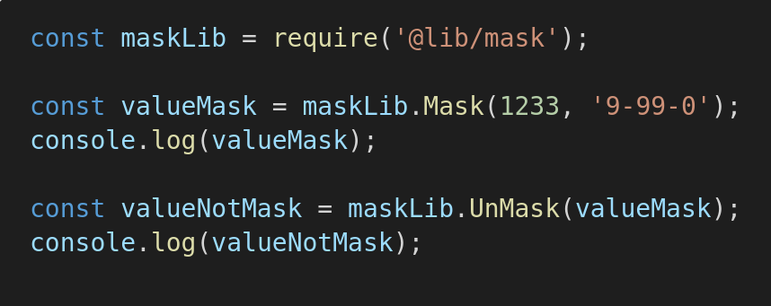
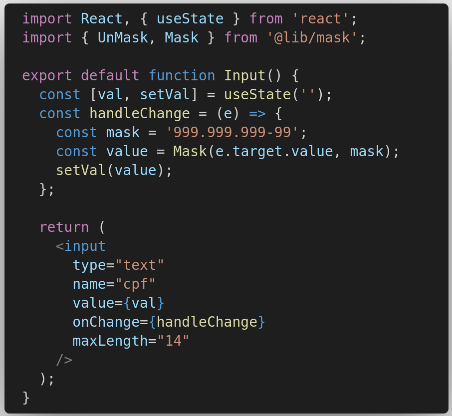
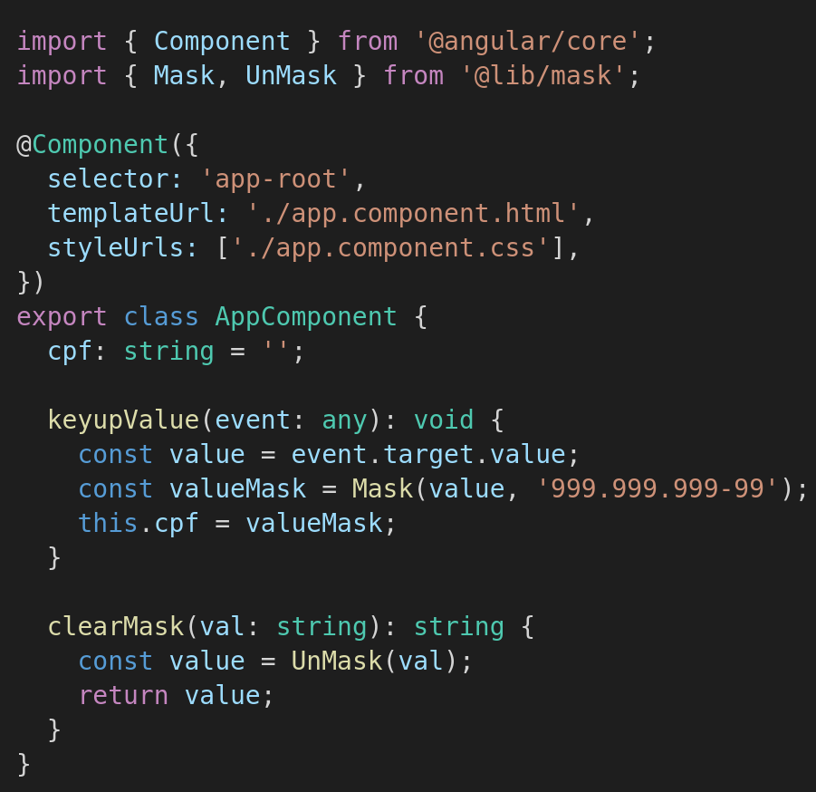

> @lib/mask

## Install

```
npm install @lib/mask

yarn add @lib/mask
```

## Usage

```js
const maskLib = require('@lib/mask');

const valueMask = maskLib.Mask(1233, '9-99-0');
console.log(valueMask);

const valueNotMask = maskLib.UnMask(valueMask);
console.log(valueNotMask);
```

```js
import { Mask, UnMask } from '@lib/mask';
const patterns = ['999.999.999-99', '99.999.999/9999-99'];

Mask('12345678901', patterns);
// 123.456.789-01
Mask('12345678000106', patterns);
// 12.345.678/0001-06
```

### Patterns:

| Code  | Significado      |
| ----- | ---------------- |
| **9** | Números (0 a 9)  |
| **A** | Letras (A a Z)   |
| **S** | Números e letras |

## Exemplos

<h1 align="center">
  
</h1>

## Reactjs

<h1 align="center">
  
</h1>

## Angular

<h1 align="center">
  
</h1>

## License

MIT © Cosmo Guedes
